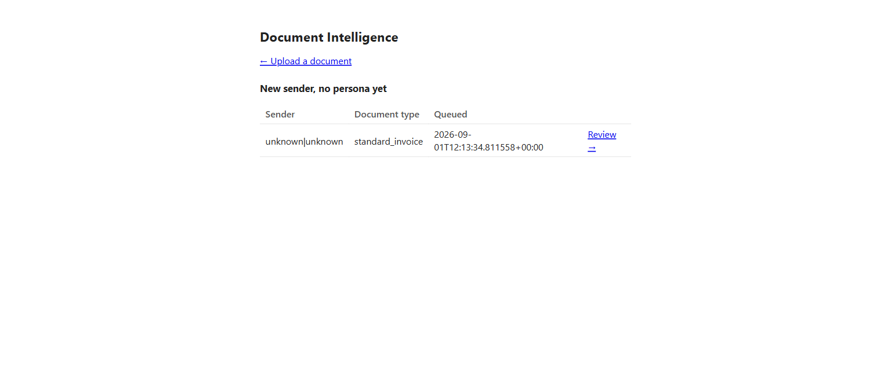

# docintel

**Every vendor bill your AP team touches by hand today, docintel reads, checks, and routes —
and only hands you the ones that genuinely need a person.**

Right now, someone on your team opens each invoice, figures out who sent it and what it is,
copies the numbers that matter into your system, checks whether what's *owed* actually matches
what's *printed* (they're not always the same — a bill with a balance forward often prints a
big total that isn't the amount due), and hopes nothing was missed. docintel does that first
pass automatically, on every document, and tells you — per field, not just per document — how
sure it is. The ones it's confident about go straight through. The ones it isn't land in a
review queue with the reason attached, not just a red flag.

## What it actually does

1. **Reads the document** — a scanned image, a native PDF, a `.docx`/`.xlsx`, or an email with
   attachments — the same way regardless of format.
2. **Works out whose bill it is, and what kind** — an invoice, a credit memo, a statement —
   before extracting a single field.
3. **Pulls the fields that matter** for that vendor: totals, dates, account numbers, line
   items — using rules you write once per vendor, not a generic guess.
4. **Applies the business rules** that turn *what's printed* into *what's actually owed* — the
   part every manual process gets right eventually but a naive script gets wrong on day one.
5. **Flags anything a person should look at**, with the specific reason attached (a low-confidence
   field, an arithmetic mismatch, a vendor it's never seen before) — never a silent guess.

## What one result looks like

This is a real output record — actually run through `docintel process` against a real invoice
in this project's test corpus, not a mock-up (trimmed to the fields that tell the story; the
full record also carries every line item, the confidence of every other field, and a full audit
trail):

```json
{
  "schema_version": "1",
  "document_id": "northstar-edco-077087",
  "doc_type": "standard_invoice",
  "disposition": "processed",
  "lane": "high",
  "review_flag": false,
  "fields": {
    "vendor_name": "EDCO WASTE & RECYCLING SERVICE",
    "prior_balance": "298.34",
    "current_charges": "69.62",
    "total_printed": "367.96"
  },
  "derived": {
    "amount_payable": "69.62",
    "payable_basis": "current_charges",
    "carried_balance": "298.34"
  },
  "confidence": {
    "total_printed": 0.90,
    "current_charges": 0.99
  }
}
```

The printed total is **367.96** — the biggest number on the page, in the biggest box. The
amount actually owed is **69.62**: a prior balance of 298.34 was already carried forward
(`derived.carried_balance`), and only the current period's charges are due. A person reading
this bill quickly would reasonably pay the wrong number — this exact invoice's filename is
literally *"current charges can be misleading, paying \$69.62."* docintel's `derived.amount_payable`
is never the raw printed total by default — it's computed from `prior_balance` and
`current_charges`, the two fields actually printed on the bill. `fields` is always what's
printed, verbatim; `derived` is always the answer to "what do we actually pay" — keeping the two
separate is the one distinction this whole system exists to protect.

`docintel serve` runs a local web UI over the same pipeline, where the queue above becomes a
real page: every document that didn't clear the bar, waiting for a decision.



## Supported file types

| Format | Needs LibreOffice? | Without it |
|---|---|---|
| `.pdf` (native or scanned) | No | — |
| `.png` `.jpg`/`.jpeg` `.tiff`/`.tif` `.bmp` `.gif` | No | — |
| `.xlsx` | No | Extracts through a pure-Python fallback — a real HTML/image rendering built from the workbook itself, not a soffice conversion. Slightly lower fidelity than the LibreOffice path, never a dead letter for lack of it. |
| `.docx` | **Yes** | Dead-letters with a clear, actionable error (`"LibreOffice ('soffice') is not installed or not on PATH"`) — there's no fallback for Word documents today. |
| `.txt` `.csv` `.html`/`.htm` | No | — |
| `.eml` / `.msg` | No (`.msg` needs the `email` extra) | Unwrapped automatically — every real attachment inside becomes its own document, processed on its own merits, through this same table. |

One call (`docintel process`) handles every row above the same way — no format-specific flag,
no branching in your own code.

## Whose bill is it, and how do you add a new vendor?

Before extracting anything, docintel decides two things: *whose* document this is (a **claim**
rule — a printed name, address, or account number specific enough that no other business prints
it) and *what kind* it is (a **ladder** of rules, checked in order, that picks the document
type). Both are plain JSON, not code — a company you onboard is two small files:
`pack.json` (the claim + ladder) and `persona.json` (where each field sits on that vendor's
layout).

Onboarding a new vendor needs no commit access to this repo — see
**[Onboard your first vendor](#onboard-your-first-vendor)** below for the two-file walkthrough,
or **[`docs/onboarding/COMPANY-CONFIG-TEMPLATE.md`](docs/onboarding/COMPANY-CONFIG-TEMPLATE.md)**
for the non-engineer-facing version a vendor-review process can fill in directly.

## Where this actually stands today

docintel ships as a pure framework — a fresh install knows about **zero** companies; every
vendor's rules are something you write. The extraction engine and the confidence-gating logic
are the mature part of this project; packaging, defaults, and day-two operational surface
(auth on the web UI, deployment tooling, a stability guarantee on the JSON schema) are earlier —
this is **alpha**, and it says so plainly rather than papering over it.

**[`docs/BUGS-FEATURES-PRODUCTION.md`](docs/BUGS-FEATURES-PRODUCTION.md)** is the running, honest
list of what's broken, what's missing, and what production actually needs — read it before
deciding whether a gap you hit is known or new. It's the single most trustworthy status doc in
this repo; start there if you're deciding whether to adopt this now or wait.

## Install

```bash
pip install "docintel[ui] @ git+https://github.com/Jetrix-TJ/DocIntel.git"
```

Contributing to docintel itself instead of just using it? Clone the repo and install editable:
`pip install -e ".[dev,ui]"`.

## Run your first document

```bash
docintel process path/to/an/invoice.pdf --json
```

That's the whole loop: read the page, figure out which company it belongs to and what kind of
document it is, extract the fields that company cares about, apply any business rules that
decide what's actually owed, and emit one JSON record — always one, even when nothing could be
extracted (see `disposition` in the output: `processed`, `skipped`, or `dead_letter`).

## As a library, in your own code

```python
from docintel import build_pipeline
from docintel.adapters.vision.fake import FakeVision  # or a real vision adapter

pipeline = build_pipeline(vision=FakeVision())
record = pipeline.process(document_id="d1", source_path="invoice.pdf")
```

**One `Runner` per concurrent worker, not one shared across threads — and PDF
rendering itself is also not thread-safe, independent of `Runner` count.** A `Runner`
keeps small mutable state for the documents it processes (an in-run duplicate-detection
index, a processed-document counter) — safe for one worker calling `.process()`
repeatedly, not safe for two threads calling `.process()` on the *same* `Runner` at
once. `build_pipeline()` is cheap to call again per worker (the packs and personas it
loads are cached process-wide), so the right pattern for a concurrent service is one
`Runner` per worker/thread, built once and reused for that worker's whole lifetime —
never a single `Runner` shared across concurrent callers.

A `Runner` per worker fixes the Python-level state; it does NOT make concurrent PDF
rendering safe, because pypdfium2 (reached during annotation detection) holds
process-global native state — even one `Runner` per thread still crashes if two
threads render PDFs at the same time. `docintel` serializes its own internal calls
into pypdfium2 with a lock, but if your own code also renders PDFs directly
alongside `docintel` in the same process, use process-based concurrency
(`multiprocessing`, or a WSGI server's process workers rather than threads) for true
isolation.

## Real-time notification

`docintel` doesn't include an inbox watcher or a webhook receiver — that's your own
infrastructure's job, whatever it looks like — but `pipeline.process(...)` is a plain synchronous
call, so wire it into whatever already tells you a document has arrived. To know the *instant* a
document needs a human, without polling, register a hook before building the pipeline:

```python
from docintel import build_pipeline, HookRegistry
from docintel.adapters.vision.fake import FakeVision  # or a real vision adapter

def notify_if_needs_review(ctx, nxt):
    ctx = nxt(ctx)  # let the pipeline finish deciding lane/review_flag first
    if ctx.review_flag or ctx.lane == "low":
        my_own_notifier(ctx.document_id, ctx.lane)  # your Slack/email/webhook — your choice
    return ctx

hooks = HookRegistry()
hooks.register("beforeEmit", notify_if_needs_review, pack="my_integration")
pipeline = build_pipeline(vision=FakeVision(), hooks=hooks)
```

`beforeEmit` fires after the pipeline has already decided `lane`/`review_flag`/`regen_flag` for
every document it emits a record for (including skipped and dead-lettered ones), so this hook sees
the real routing decision, not a guess — and it runs inline, in the same call that processed the
document, so there's no polling interval to wait out. `docintel` deliberately doesn't pick the
channel (email/Slack/webhook) for you; that stays your own code, in `my_own_notifier`.

## Onboard your first vendor

Start with **[`docs/onboarding/COMPANY-CONFIG-TEMPLATE.md`](docs/onboarding/COMPANY-CONFIG-TEMPLATE.md)**
— fill it in with the company's document types and the fields your team actually needs, attach
one real sample document per type, and hand it to whoever reviews new vendors. No engineering
background required to fill it in.

For how what you fill in actually turns into a working configuration — and what's automated
versus what a human always checks — see
**[`docs/onboarding/CONFIG-SPACE.md`](docs/onboarding/CONFIG-SPACE.md)** or the illustrated version,
**[`docs/onboarding/ONBOARDING-EXPLAINER.html`](docs/onboarding/ONBOARDING-EXPLAINER.html)** (open
directly in a browser).

**No commit access to this repo?** A vendor, or a whole new company, can be onboarded entirely
from your own project — `DOCINTEL_EXTRA_PERSONAS_DIR` for a vendor under an existing pack,
`build_pipeline(..., extra_packs=[pack])` for a wholly new one. Neither touches the installed
package, so `pip install --upgrade` never wipes them out. Full step-by-step, with a worked example
(three real invoices, three different clients, zero repo edits), is in the one doc below.

## Go deeper — one page, everything

**[`docs/DOCINTEL-FEATURE-EXPLORER.html`](docs/DOCINTEL-FEATURE-EXPLORER.html)** (open directly in
a browser) — the single, complete reference: install, the 11-stage pipeline explained, when and
how the Gemini vision fallback runs, an interactive composer that assembles real code live as you
toggle features, every currently-configured vendor, the full CLI, the complete `pack.json` and
`persona.json` JSON schema (every field, every closed vocabulary, all 14 validation rules), gold
data & scoring, and a troubleshooting section built from the real gotchas hit while building this.

**[`docs/DOCINTEL-TECHNICAL-OVERVIEW.html`](docs/DOCINTEL-TECHNICAL-OVERVIEW.html)** — a shorter,
narrative companion for a reviewing engineer deciding whether to adopt this: the two ideas that
explain the whole design, a walkthrough of one document end to end, per-mechanism Q&A, and an
honest table of what's deliberately not shipped yet.

(The honest status doc — what's broken, what's missing — is linked near the top of this README,
under [Where this actually stands today](#where-this-actually-stands-today).)

## Everyday commands

| Command | What it does |
|---|---|
| `docintel process <paths...>` | Run one or more documents through the real pipeline |
| `docintel serve` | Local web UI — upload one document, see the result, work the review queue |
| `docintel replay-gold` | Score the labelled corpus — the number that matters when you change anything |
| `docintel accuracy-report` | The same score, read aloud: percent correct by company and document type, every failure named — hand this to someone who isn't reading code |
| `docintel queue-status` | How many documents are waiting on a human decision, and for how long |
| `docintel new-pack` | Scaffold a brand-new company's `pack.json` + a starter persona |
| `docintel validate-persona` | Self-check a persona file — scaffolded or hand-edited — before asking anyone else to look at it |
| `docintel draft-gold` | Turn one clean pipeline run into a draft gold fixture — no review-queue correction needed first |

Full command list: `docintel --help`.
