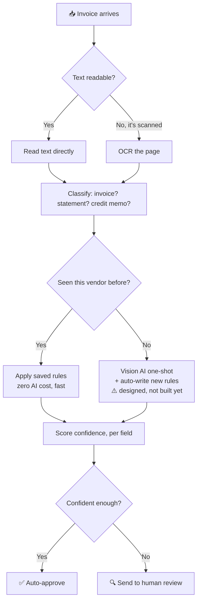

# Document Intelligence POC — Status (2026-07-30)

## What it does

Reads vendor invoices / telecom bills → pulls out vendor, amounts, dates, line
items → routes each one to auto-approve, review, or reject. **No AI runs at
extraction time** — each vendor has a small rule file, and a generic engine
reads the page with it. Cheap and fast, once the rules exist.

## Where we are

- **10 vendors live**, across 2 domains (vendor AP invoices, telecom bills)
- **71.5%** field accuracy on our hand-labelled test set (263 checks, 10 sample docs)
- **1 of 10** documents currently gets every single field right end-to-end
- Most of the remaining gap is cheap to close: rules that just haven't been
written yet, not values the system is somehow unable to read

## Top challenges

1. **Biggest risk — money going to the wrong place.** Our "is this bill
  actually addressed to us?" check only works on 5 of our 10 vendors. On the
   other 5, a bill mentioning our name anywhere could get auto-approved even
   if it's really addressed elsewhere.
2. **Confidence score isn't reliable yet.** Some of our *most* confident
  extractions are wrong — the score doesn't consistently track correctness.
3. **We've only tested on one sample per vendor.** We don't yet know if a
  vendor's rules still work on their *next* invoice, only that they work on
   the one we were given.
4. **Today's test result:** we had a fresh AI agent write extraction rules
  for one vendor from scratch, with no answer key (a "blind" test). It did
   reasonably well, but scored *worse* than our current hand-tuned rules —
   19/19 correct checks dropped to 17/19 on the same document. Takeaway: an
   agent can write working rules, but "point AI at a new vendor once and
   trust it" isn't reliable yet — it still needs review and iteration.

## Next steps, in priority order

1. **Get one more sample invoice per vendor** (different billing period) —
  this is a business ask, not engineering work, and it's the single most
   valuable thing we're missing: it tells us whether our rules generalize.
2. **Close the wrong-inbox gap** on the remaining 5 vendors — the one
  open item with real financial risk.
3. **Re-tune a couple of layout thresholds** that currently have almost no
  safety margin.
4. **Write the missing field rules** — the single biggest accuracy lever
  (~45 fields), best done once #1 lands so we're not fitting rules to a
   single sample.
5. **Later:** build the "new vendor" auto-onboarding path for real (the
  dashed box in the diagram above). That's the actual key to supporting
   unlimited new vendors cheaply — today it's a design, not working code.

## Explicitly not doing right now

- Running a vision AI model per document — too expensive to run at scale;
it stays a fallback for vendors we've never seen.

