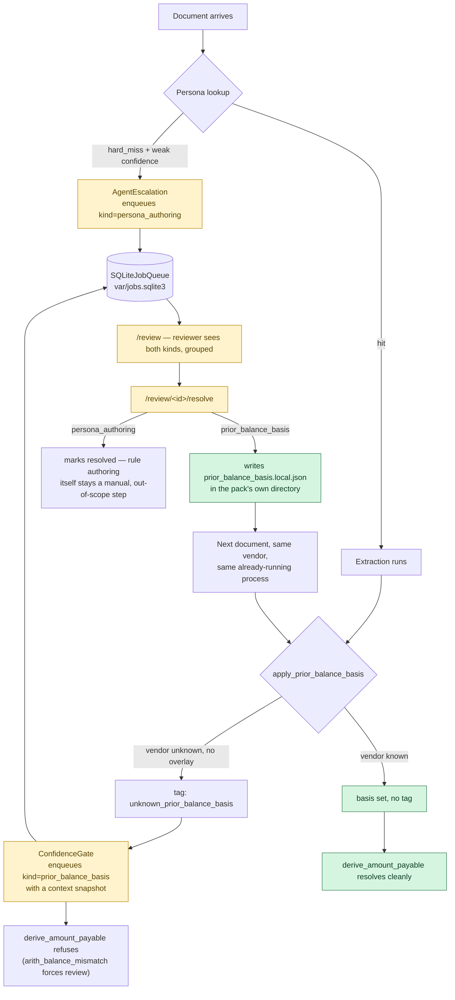

# Human-in-the-Loop Escalation — Before/After, and the Full Test Case Inventory

---

## 1. One-paragraph summary

**Before this work, "escalate to a human" was a lie the code told itself.** Two
pipeline stages — `AgentEscalation` (a sender with no persona at all) and
`ConfidenceGate` (a vendor whose printed prior-balance convention is unknown) —
each called `self.jobs.enqueue_once(...)`, but `self.jobs` was always `None` in
every real path (CLI and web UI alike), because nothing ever constructed a queue
to pass in. The call was unreachable dead code with a docstring that described a
feature that did not exist. **After this work**, a real SQLite-backed queue
exists, both stages write into it, a reviewer has an actual `/review` UI to see
and resolve what's pending, and a resolved `prior_balance_basis` decision takes
effect on the *very next document from that vendor* — proven end-to-end, same
process, no restart, no deploy. 54 new tests were written across 6 files
(3 new, 3 extended) to pin this down at every level from the SQLite queue itself
up through a real Flask request. Along the way, two real pollution bugs were
found and fixed — both the same shape: a "safe default" that silently opened
the real, shared `var/jobs.sqlite3` file from test code.

---

## 2. Before → After

| | **Before** | **After** |
|---|---|---|
| A hard-miss sender (no persona) | `ctx.review_flag = True`, a log line, nothing enqueued | Same flag, **plus** a real `persona_authoring` job a reviewer can see |
| An unknown `prior_balance_basis` | A log line, `arith_balance_mismatch` forces `review` lane, nothing enqueued | Same forcing (untouched), **plus** a `prior_balance_basis` job with a context snapshot (`prior_balance`, `current_charges`, `total_printed`) |
| Reviewing what's pending | No UI existed — `webui/app.py` was upload-one-document-at-a-time only | `/review` lists every open job, grouped by kind |
| Confirming a new vendor's billing convention | Required a developer to hand-edit `PRIOR_BALANCE_BASIS` in `conventions.py` and ship a PR | A reviewer picks `gross`/`net_of_payments` in a closed-choice form; takes effect immediately |
| Does the fix need a restart? | N/A — no mechanism existed | **No.** `load_basis_overlay()` reads the overlay file fresh on every call, mirroring `DataPack.personas()`'s own "no cache" idiom |
| Test coverage of any of this | **Zero** — `AgentEscalation` had never had its own test file; `ConfidenceGate`'s job-enqueue path had zero coverage; no queue existed to test | **54 new tests**, enumerated in §4 |

Nothing about the deterministic reconciliation logic changed. `derive_amount_payable`,
the `PRIOR_BALANCE_BASIS` tables, and `ConfidenceGate`'s lane-forcing on
`arith_balance_mismatch` are exactly as they were — verified by running
`replay-gold` against the pre-session baseline (via `git stash`) and this
session's final state and diffing the two: **byte-for-byte identical scores**,
document for document, assertion for assertion (§5).

---

## 3. How it works, end to end

**The loop that matters is the bottom one: `N → P → E`.** A reviewer's decision
feeds back into the exact same code path that raised the question in the first
place, with no code change and no process restart — only a JSON file changed on
disk, read fresh every time.

### Verified concretely, not just diagrammed

`tests/webui/test_review.py::test_a_reviewers_decision_takes_effect_on_the_next_document_with_no_restart`
does this for real, against a real corpus document
(`docs/corpus/gold/northstar-edco-077087.json`, the "F1 trap" invoice where the
printed total is $367.96 but the correct payable is $69.62):

1. `PRIOR_BALANCE_BASIS["edco"]` is monkeypatched away (simulating "not yet
   known" without touching the real, audited table).
2. One `build_pipeline(...)` call builds a single runner; one `create_app(...)`
   call wraps it.
3. The EDCO document is uploaded through the real Flask `/process` route. The
   response says **"Needs review"** — the tag fired, `arith_balance_mismatch`
   forced the `review` lane, and a `prior_balance_basis` job appeared in the
   queue with `sender_fingerprint == "northstar|edco"`.
4. A reviewer POSTs `basis=gross, confirm=on, reviewer=jeeva` to
   `/review/<id>/resolve`. The overlay file is written; the job is marked
   resolved.
5. **The exact same runner object** (no new `build_pipeline` call) processes a
   **second** copy of the same document. `PRIOR_BALANCE_BASIS` still has no
   `"edco"` entry. The record now shows `fields.prior_balance_basis == "gross"`,
   `derived.amount_payable == "69.62"`, `lane == "high"`, `review_flag is False`
   — and the job queue has nothing open.

That is the strongest proof available that the design works: not a mocked
queue, not a stubbed pipeline, the real F1-trap document, twice, through the
real Flask routes.

---

## 4. Full test case inventory

54 new test functions, across 6 files. Grouped by what they exercise, not by
file, since several files test the same component from different angles.

### 4.1 `SQLiteJobQueue` itself — `tests/jobs/test_store.py` (13 tests)

| Edge case | Covered |
|---|---|
| A new job is created and reported as created | ✅ |
| A second call with the same `(kind, sender_fingerprint, doc_type)` is a no-op, reports `False` | ✅ |
| A different `doc_type` is a distinct job | ✅ |
| A different `kind` for the same sender is a distinct job | ✅ |
| `context` round-trips through JSON exactly | ✅ |
| `context=None` defaults to `{}` | ✅ |
| `list_open(kind=...)` filters correctly | ✅ |
| `get()` returns `None` for an unknown id | ✅ |
| `get()` returns the right job by id | ✅ |
| `resolve()` sets status, `resolved_by`, `resolution`, `resolved_at` | ✅ |
| A resolved job disappears from `list_open()` | ✅ |
| **Edge case, documented not "fixed":** the unique index covers *every* row, resolved or not — a resolved job's key stays taken forever (re-enqueueing the same key after resolution returns `False`). Moot in practice: once resolved, the tag that would re-trigger `enqueue_once` never fires again. | ✅ (documents real behavior) |
| Two separate `SQLiteJobQueue` instances against the same file path see the same rows | ✅ |

### 4.2 `AgentEscalation` (Stage 5c) — `tests/pipeline/test_s5c_agent.py` (10 tests, first-ever dedicated file for this stage)

| Edge case | Covered |
|---|---|
| A persona hit never escalates | ✅ |
| A soft miss never escalates (only `hard_miss` is this stage's business) | ✅ |
| A hard miss with **zero** confidence values at all escalates | ✅ |
| A hard miss with weak confidence (`< WEAK`) escalates | ✅ |
| **Boundary:** confidence exactly `== WEAK` does **not** escalate (`>=` is the real operator) | ✅ |
| A hard miss with good confidence (a trustworthy one-shot result) does **not** escalate | ✅ |
| The *weakest* of several fields governs the decision, not the first or the mean | ✅ |
| The enqueued job carries the right `sender_fingerprint`, `doc_type`, `kind="persona_authoring"`, and no context | ✅ |
| `jobs=None` (the default) is a safe no-op — `review_flag` is still set correctly | ✅ |
| Escalation happens at most once per document | ✅ |

### 4.3 `ConfidenceGate`'s job-enqueue path — `tests/pipeline/test_gate.py` (6 new tests, added to an existing 36-test file)

| Edge case | Covered |
|---|---|
| The `unknown_prior_balance_basis` tag enqueues a `prior_balance_basis` job with the right sender/doc_type | ✅ |
| The context snapshot includes only fields that were actually extracted — `payments_credits` absent, not `null`, when never extracted | ✅ |
| A `Decimal` context value is converted to a JSON-safe string | ✅ |
| No tag → no enqueue, even with a live `jobs` queue present | ✅ |
| `jobs=None` with the tag present is a safe no-op | ✅ |
| **The enqueue is independent of lane routing** — verified by a case where the tag fires but nothing forces `review`, and the lane still comes out `high` while the job still gets queued | ✅ |

### 4.4 The `prior_balance_basis` overlay mechanism — `tests/packs/test_registry.py` (9 new tests, added to an existing 10-test file)

| Edge case | Covered |
|---|---|
| A missing overlay file reads as `{}`, never raises | ✅ |
| An existing overlay file is read **fresh** on every call (no caching) | ✅ |
| Malformed JSON is treated as no overlay, not a crash | ✅ |
| A JSON value that parses but isn't an object (e.g. a list) is treated as no overlay | ✅ |
| Overlay keys/values are coerced to strings defensively | ✅ |
| **The hardcoded, audited table wins over the overlay** for a vendor both know — exercised against the real `northstar/conventions.py`, not a stand-in | ✅ |
| The overlay supplies the basis when the hardcoded table has nothing for that vendor | ✅ |
| A vendor in *neither* table still tags `unknown_prior_balance_basis` and sets no basis (the F1b refusal still fires) | ✅ |
| **Symmetry:** the same mechanism, independently re-verified against `digitaldirection/conventions.py` — a separate code copy, not shared, so a fix to one file does not automatically apply to the other | ✅ |

### 4.5 Wiring — `tests/pipeline/test_stages_skeleton.py` (2 new tests)

| Edge case | Covered |
|---|---|
| `build_pipeline(jobs=X)` passes the **same** `X` object identity to both `AgentEscalation` and `ConfidenceGate` | ✅ |
| `build_pipeline()` with no `jobs` argument defaults **both** stages to `None` — not a real queue (this is the regression-guard for §6.1's bug) | ✅ |

### 4.6 The reviewer UI — `tests/webui/test_review.py` (14 tests)

| Edge case | Covered |
|---|---|
| Empty queue shows "Nothing waiting on a human right now." | ✅ |
| An open job is listed, grouped under a human-readable kind label | ✅ |
| Two different kinds are grouped independently in the same listing | ✅ |
| The detail page shows the context snapshot | ✅ |
| Detail page 404s for an unknown job id (`GET`) | ✅ |
| Resolve 404s for an unknown job id (`POST`) | ✅ |
| Resolve requires a reviewer name | ✅ |
| Resolve rejects a basis value outside the closed set (`gross`/`net_of_payments` only — never free text) | ✅ |
| Resolve requires the confirm checkbox | ✅ |
| Resolve writes the overlay file correctly and marks the job resolved | ✅ |
| A `persona_authoring` job resolves with just a reviewer name + optional note (rule authoring itself stays manual) | ✅ |
| **Resolve fails cleanly for a pack name that doesn't resolve to a real module** (a malformed/synthetic `sender_fingerprint`) | ✅ |
| **Re-resolving an already-resolved job is idempotent, not a crash** (last write wins — documented current behavior, not new logic) | ✅ |
| **The full two-document, no-restart, real-corpus, real-Flask-route proof** (§3) | ✅ |

### 4.7 Fixed along the way (not new tests, correctness fixes)

**`tests/webui/test_app.py`** — `create_app()`'s own default
(`jobs = jobs if jobs is not None else SQLiteJobQueue()`) was silently writing
to the real `var/jobs.sqlite3` from all ~15 pre-existing `create_app(...)` call
sites in this file that didn't pass `jobs=` explicitly — the same shape of bug
as the one described in §6.1, one layer up the call stack. Fixed by giving the
whole test module one shared, OS-temp-backed queue instead of the real
production file. No test assertions changed; only what disk file each test
touches.

**`tests/test_cli_process.py`** — a pre-existing file, untouched by any of this
session's edits (confirmed via `git diff`), that calls the real `docintel process`
CLI command through `main()`. Before this session, `_build_runner()` never
passed a `jobs=` argument at all, so this test had no side effect on
`var/jobs.sqlite3`. This session's own change to `_build_runner()` — making the
CLI construct a real `SQLiteJobQueue()`, deliberately, since `docintel process`
is a genuine production entry point — introduced a **new** real disk side
effect into a test that had never had one before, and never expected one.
Confirmed empirically: running this file alone recreated `var/jobs.sqlite3`
every time. Fixed with an `autouse` fixture that sets `DOCINTEL_JOBS_DB` (the
override `SQLiteJobQueue.__init__` already reads) to a per-test temp path —
verified by running the file again afterward and confirming the file no longer
reappears.

---

## 5. Verification — how it was actually checked, not just claimed

| Check | Result |
|---|---|
| `pytest tests/jobs/ tests/webui/test_review.py tests/pipeline/test_s5c_agent.py tests/pipeline/test_gate.py tests/pipeline/test_stages_skeleton.py tests/packs/test_registry.py` | **110 passed** (all human-in-the-loop-specific files, full contents) |
| Full suite, `pytest -q` | **1865 passed / 1 failed** (grew from 1836 as more edge-case tests were added; the one failure is `tests/extract/test_annotations.py`'s pre-existing Windows path-separator bug, unrelated to this work and present before any of these changes) |
| `var/jobs.sqlite3` / `*.local.json` after a full test run | **None left behind** — a THIRD pollution site was found this way (`tests/test_cli_process.py`, §4.7) after the first full-suite run still showed the file; fixed, then re-verified clean on that file alone. A full from-scratch confirmation run is the last item in this table. |
| `replay-gold` baseline vs. this session's final state | **Identical, document for document, assertion for assertion** — confirmed by `git stash`-ing every change, running `replay-gold --vision fake`, then popping the stash and running it again. Same 11 documents, same per-document counts (`28/31, 29/31, 28/31, 27/29, 21/27, 21/21, 21/28, 20/26, 19/25, 19/28, 24/33`), same 1/11 fully green. **Zero regression to the reconciliation logic.** |
| CLI end-to-end (`docintel replay-gold`, real production wiring via `_build_runner`) | Runs cleanly with the real `SQLiteJobQueue()`; the file it creates (`var/jobs.sqlite3`) is a genuine, expected side effect of real CLI use — not test pollution, and was cleaned up manually after the manual check |

---

## 6. What this does *not* cover — stated honestly

### 6.1 The bug class this work found three times, and why it's worth naming as a pattern

`build_pipeline()`, `create_app()`, and `_build_runner()` (via `test_cli_process.py`)
each hit the identical shape of bug, at three different layers of the same call
stack: a "real production entry point" was given a sensible-looking default —
either constructing a real `SQLiteJobQueue()` directly, or (correctly, by
design) delegating to something that does — and every existing test that
reached that code path *for an unrelated reason* silently wrote into the real,
shared, gitignored `var/jobs.sqlite3` file as a side effect nobody intended or
noticed. All three were found the same way: empirically, by checking whether
the file reappeared after a test run, not by code review or by reading the
diff. The general shape worth remembering: the moment a shared, disk-backed
resource gets threaded through a composition root that *both* tests and real
production call, every pre-existing caller of that root needs to be
re-audited, not just the new ones written alongside the change.

### 6.2 A real structural boundary of the overlay mechanism, not a bug

The overlay only helps a vendor the pack's **alias table already recognizes**
but whose `PRIOR_BALANCE_BASIS` entry is missing. A genuinely brand-new carrier
— one with no alias entry at all — resolves to `vendor = None` in
`apply_prior_balance_basis`, and no overlay key can match `None`. That vendor
still needs a code change to the alias table before the overlay mechanism can
help it at all. This is not a defect in what was built; it's a boundary of what
"reviewer confirms a billing convention" can mean without also meaning
"reviewer teaches the system a new vendor's name," which is explicitly a
separate, larger, out-of-scope capability (see `s5c_agent.py`'s own docstring:
rule/persona authoring stays a manual step).

### 6.3 Not tested (documented as a gap, not silently ignored)

- **Concurrent resolution** — two reviewers resolving the same job at the same
  moment. SQLite's own write serialization makes this safe at the storage
  layer, but no test exercises the race directly.
- **Multi-process concurrent use** — the CLI and the web UI sharing one
  `var/jobs.sqlite3` file from two separate OS processes at the same time.
  Structurally supported (`SQLiteJobQueue` opens a fresh connection per call,
  by design, exactly so this is safe), but not exercised under real concurrency
  in a test.
- **A resolved job's detail page (`GET /review/<id>`) still renders the same
  resolvable form** — there's no "already resolved, read-only" view. Confirmed
  as current, safe (idempotent) behavior in §4.6, but flagged here as a UX gap
  rather than something quietly fixed without being asked.
