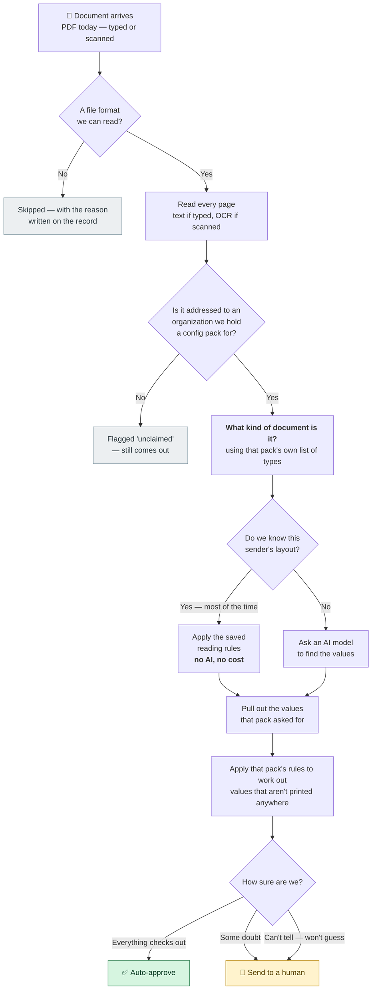
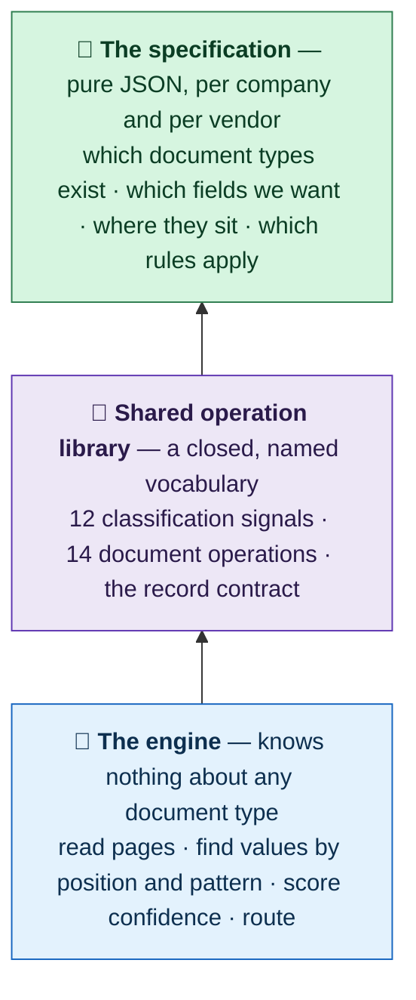
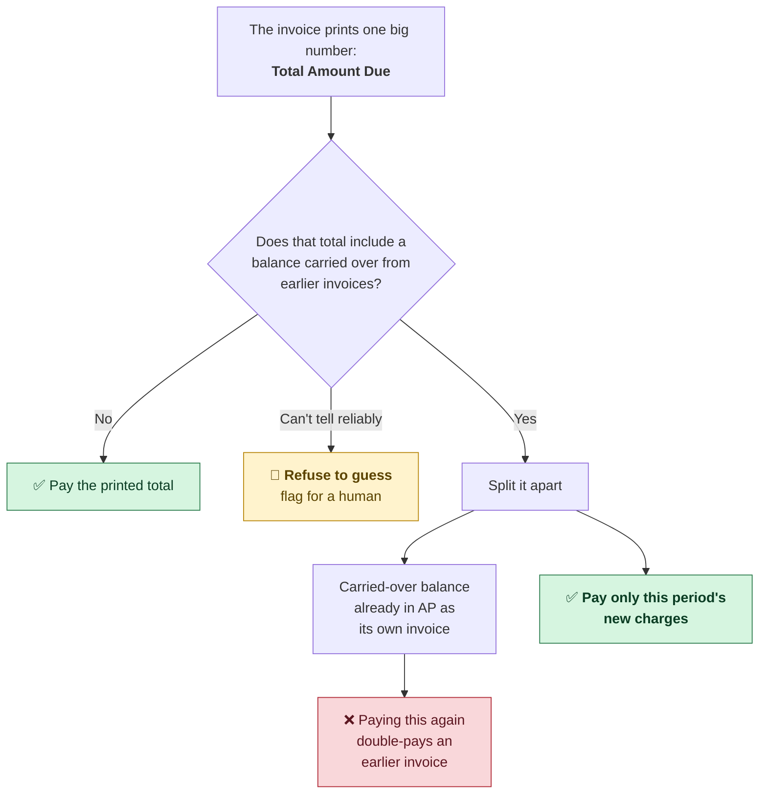
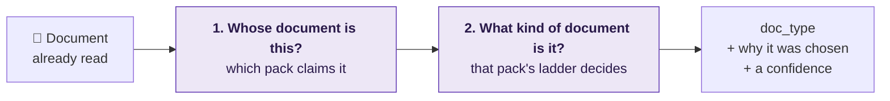
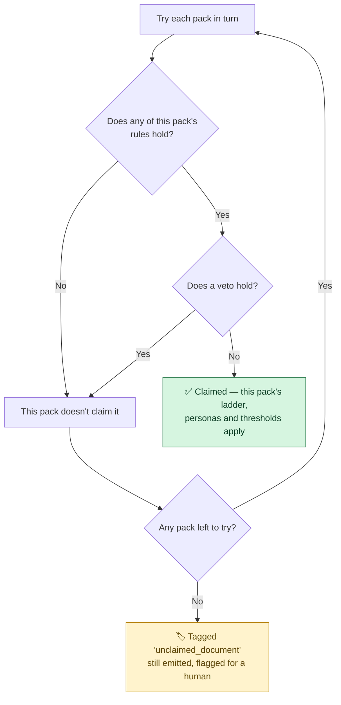
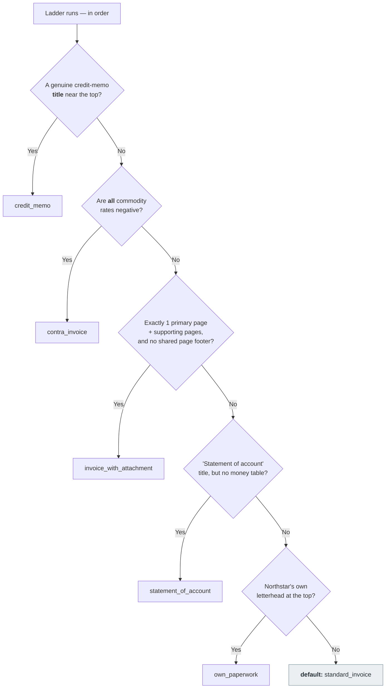
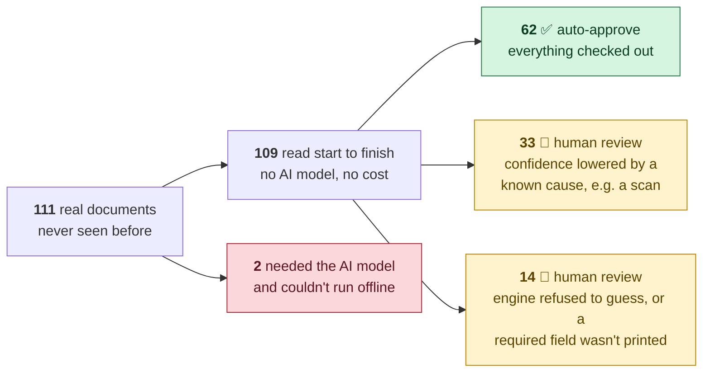

# Document Intelligence POC — Status

---

## 1. One-paragraph summary

**The goal of this POC is a general document extraction pipeline: you specify
what data you want out, and the pipeline extracts it.** What counts as "the data
you want" is expected to differ from company to company and from vendor to
vendor — different document types, different field names, different rules for
turning what's printed into what you actually need. So the target is not a
particular set of fields; it is that the *specification* is configuration rather
than code.

Mechanically: it reads documents (PDF, typed or scanned) and emits one
structured JSON record each. Nearly every document read is deterministic
geometry + patterns driven by JSON config rather than an LLM — 109 of 111 on the
held-out run — so it is fast, repeatable, and near-free to run. The remaining
~2% escalate to a vision model (§5.2).

**The configuration thesis is holding up, and its limit is now measured.** Three
companies are configured today, and they are genuinely unalike — they identify
their own documents on different grounds (two guard on the bill-to, one on the
sender), declare different document-type vocabularies, and ask for different
fields. Ten vendor profiles across them are pure data, and the third company's
entire pack is one JSON file with **no Python at all**. On the labelled corpus,
every extracted value that feeds a payment decision is correct, and the pipeline
ran 111 unseen production documents with zero crashes.

⚠️ **But "no code at all" describes what a pack can *declare*, not yet what it
can *run*.** A data-only pack gets the ladder, tag rules, claim guard, field
sets, thresholds and aliases — it does not get pack hooks. Two things follow, and
both are load-bearing. It has no sender fingerprint, so **persona lookup never
matches** and the cached route that handled 109/109 documents is unreachable —
which is why `acme_freight` has zero personas and has never processed a document.
And it has no billing-convention table, so `prior_balance_basis` is absent and
the payable derivation correctly refuses to guess — meaning **a data-only pack
could not produce the CentraCom answer that §2.2 sets as the bar.** The gap is
two named hook kinds (`references`, `conventions`), not an architectural one, and
`datapack.py` states it in the source. See [§2.4](#24-packs-and-personas--the-config-not-code-design).

**The open question is reach.** Every document seen so far is a billing
document, and the labelled set is essentially the data the rules were written
from — so the headline accuracy figure describes fit, not predictive power, and
nothing yet demonstrates the pipeline on a document family structurally unlike
the current corpus. Closing that gap is what stands between this POC and a
go/no-go decision.

---

## 2. What it does

### The whole thing in one picture




**Note what is *not* asked.** The engine never decides "is this an invoice?" It
asks whether it can read the file, whether any configured organization claims
it, and then — using that organization's own list of document types — what kind
of document it is. Invoices are what *this POC is configured for*, not what the
engine is limited to. See [§2.1](#21-what-is-the-engine-and-what-is-just-this-poc).

**Nothing is ever silently lost.** Every document that goes in produces a record
coming out — a skipped file, an unclaimed document, or an outright failure all
come out labelled as such rather than vanishing. That guarantee is enforced in
code, not by convention.

### 2.1 What is fixed machinery, and what is specified per customer

The central design claim: **what to extract is a specification, not code.** Three
layers, and only the top one changes when a new company or vendor arrives.




**Nothing about document types is built in.** A pack declares its own vocabulary
in JSON and the classifier is an ordered ladder pointing at those names. Today's
packs happen to declare `standard_invoice`, `credit_memo`, `contra_invoice`,
`invoice_with_attachment`, `telecom_bill`, `statement_of_account`,
`disconnect_notice` and `own_paperwork` — but the engine has no idea what any of
those words mean. Swap
the ladder, get a different vocabulary. The same is true of fields: a persona
lists the values that company wants from that vendor, and nothing outside the
pack knows those names either.

**The three configured companies are already unalike**, which is the best
evidence so far that the specification layer is doing real work:


|                             | `northstar`               | `digitaldirection`         | `acme_freight`            |
| --------------------------- | ------------------------- | -------------------------- | ------------------------- |
| Business                    | Recycling AP              | Telecom expense management | Freight                   |
| Identifies its documents by | Who they're billed **to** | Who **sent** them          | Who they're billed **to** |
| Document types declared     | 5 + default               | 2 + default                | 2 + default               |
| Fallback type               | `standard_invoice`        | `telecom_bill`             | `standard_invoice`        |
| Vendor profiles             | 6                         | 4                          | 0                         |
| **Python code**             | yes                       | yes                        | **none at all**           |


`acme_freight` is the load-bearing one: a whole company onboarded as pure data,
with a test that fails if that ever stops being possible.

**Where the generality currently stops:**


| Layer                                     | Reusable as-is? | What you would touch                                                                                                                                             |
| ----------------------------------------- | --------------- | ---------------------------------------------------------------------------------------------------------------------------------------------------------------- |
| Reading files → pages, text/OCR, geometry | ✅ Yes           | Only to add formats — **PDF is the sole format today** (`ALLOWED_SUFFIXES` in `s2_filter.py`)                                                                    |
| Finding values on a page                  | ✅ Yes           | Nothing. Spatial + pattern matching — "the number to the right of this label" — with no semantics                                                                |
| Deciding the document type                | ✅ Yes           | Write your own ladder — it's JSON                                                                                                                                |
| Confidence scoring & routing              | ✅ Yes           | Tune thresholds                                                                                                                                                  |
| Which fields get extracted                | ✅ Yes           | Write your own personas — it's JSON                                                                                                                              |
| The 14 document operations                | ⚠️ Extend       | The current set leans to billing arithmetic (carried balances, line-sum checks). A different domain composes what fits and adds named ops to the closed registry |
| Output record shape                       | ⚠️ Partly       | The contract always carries `line_items`, `charges`, `sub_account`, `scanline`                                                                                   |
| **Pack hooks** (fingerprint, conventions, references) | ❌ **Python** | No declarative equivalent exists. A JSON-only pack gets the ladder and nothing else — so it has no persona lookup and cannot derive a payable from a carried balance (§2.4) |


**So the specification layer is genuinely open; the operation library, the record
schema and the pack-hook gap are the three places a new domain would push back.**
None is a redesign — the op registry is explicitly built to be extended, with a
test and a real document required per addition, and the two missing hook kinds are
named — but none is free either.

⚠️ **This has not been tested outside billing documents.** Three companies is
real evidence for "varies company to company," and ten vendor profiles for
"varies vendor to vendor." It is *not* evidence that the pipeline handles a
structurally different document family. Treat the ✅ rows as **designed to be
general, not yet proven general.**

### 2.2 The hardest case in the corpus, and why it's the benchmark

"Extract the total" sounds like reading a number off a page. It isn't — and the
corpus contains the cases that prove it. **This is the bar the specification
language has to clear:** a value the customer wants that is *nowhere printed on
the document*, and has to be derived by rules that differ per vendor.


| Document               | Printed total  | What the customer actually wants | Gap            |
| ---------------------- | -------------- | -------------------------------- | -------------- |
| CentraCom `0384043574` | **$33,876.40** | **$13,752.60**                   | **$20,123.80** |
| EDCO `77087`           | $367.96        | $69.62                           | $298.34        |
| U-Pak `4378107`        | $14,789.77     | *(refuses to say)*               | —              |


Trusting the big bold number is wrong by twenty thousand dollars on one
document. And the right answer isn't a different label to read — 13,752.60 has
to be *computed*, from parts that sit in different places on each vendor's
layout. All three behave correctly today (§4.1).

**Why the printed total is wrong here.** These are running-account bills: each
period restates what was owed before, plus what's new. The old part was already
recorded against its own earlier document, so treating the printed total as the
amount to act on counts it twice.




The two trap documents split exactly this way, to the cent:


|           | Printed total | = carried over | + this period **(the wanted value)** |
| --------- | ------------- | -------------- | ------------------------------------ |
| CentraCom | $33,876.40    | $20,123.80     | **$13,752.60**                       |
| EDCO      | $367.96       | $298.34        | **$69.62**                           |


U-Pak is the third case: the pipeline cannot establish the split reliably, so it
returns **no value at all** and routes the document to a human. Refusing is a
feature — a wrong number that looks confident is far more expensive than a blank
one that asks for help.

**What this case is doing in a status document.** It is the yardstick for
whether the specification layer is expressive enough. Any extraction tool can
return a labelled number. The requirement here is that a customer can specify a
*derived* value — one assembled from several printed parts, by rules that vary
per vendor — and that the pipeline either computes it correctly or declines. The
current rules encode billing arithmetic because that is what the available
documents needed; the mechanism they use (a persona naming ops from a closed,
extendable registry) is not specific to money.

### 2.3 The pipeline

The same flow as the diagram above, in code terms. Ten stages, in
`src/docintel/pipeline/stages/`. One record out per document in, always — the
runner wraps every stage so a failure anywhere still produces a dead-letter
record rather than a silently lost document.

```
s1_intake      →  discover files, assign a stable document id
s2_filter      →  allow-list the file type (.pdf only), then read every page —
                  native text or OCR — and label pages primary / supporting
s3_classify    →  decide doc_type via a declarative "signal ladder" (JSON)
s4_persona     →  fingerprint sender/layout → pick a vendor persona
s5a_cached     →  apply that persona's cached extraction rules   ← 109/111 stop here
s5b_vision     →  escalate to a vision model when 5a can't cope  ← 2/111 reach here
s5c_agent      →  last-resort agent escalation
s6_capture     →  normalize, derive amount_payable, resolve vendor identity
s7_gate        →  assign a routing lane (high / medium / review / low)
s8_emit        →  validate against the record contract and emit
```

### 2.4 Packs and personas — the "config, not code" design

Vendor knowledge lives in **packs**, one per client company, each containing
**personas**, one per vendor that bills them.


| Pack               | Personas                                                        | Note                                              |
| ------------------ | --------------------------------------------------------------- | ------------------------------------------------- |
| `northstar`        | dtss, upak, veritiv, edco, complete_beverage, federal_recycling | 6                                                 |
| `digitaldirection` | windstream, centracom, lumen, comcast                           | 4                                                 |
| `acme_freight`     | *(none)*                                                        | **Data-only** — one `pack.json`, no Python at all |


`acme_freight` is the architecturally important one: a synthetic pack with **no
Python module at all**, proving a new company can be *declared* as pure data.
`tests/packs/test_datapack.py` fails if that ever stops being true.
Classification ladders, claim guards, and alias tables are all JSON, compiled
and validated at load.

**What a data-only pack does not get, stated honestly.** `datapack.py` registers
exactly one hook for a JSON pack — the ladder. The two shipped packs each register
four to six more, and two of those kinds have no declarative equivalent:

| Pack hook | What it does | Data pack? |
|---|---|---|
| the classification ladder | sets `doc_type` | ✅ yes |
| `resolve_vendor_fingerprint` | builds the `<pack>\|<vendor>` key **Stage 4 looks a persona up by** | ❌ no |
| `apply_billing_conventions` | supplies `prior_balance_basis`, without which the payable refuses to resolve | ❌ no |
| `collect_references` | pack-specific match keys, with provenance | ❌ no |
| tag refinements (`retag_prior_balance`, …) | corrects tags on printed amounts | ❌ no |

The first absence is the structural one: no fingerprint means no persona ever
matches, so a data-only pack cannot reach the cached extraction route at all.
The second is the expensive one: it is exactly what makes CentraCom's
`13752.60` derivable rather than a review flag.

**Why this matters commercially:** onboarding a new **vendor** to an existing
pack is a configuration change, not a software release — that much is proven, ten
times over. Onboarding a whole new **client company** is configuration up to the
point it needs a convention table or a reference collector, and both shipped
packs needed both.


### 2.5 How classification works

Classification asks **two questions, in this order**, and getting the first one
wrong is far more expensive than getting the second one wrong.




Question 1 picks the **rulebook** — the ladder, the personas, the thresholds.
Claiming a document for the wrong organization runs somebody else's assumptions
over it end to end.

#### Question 1 — the claim

A pack claims a document when **any rule holds and no veto holds.**




**The two shipped packs claim on completely different grounds**, which is why
the rules are a small set of kinds rather than one shape:


| Pack               | Claims on              | Why                                                                                                              |
| ------------------ | ---------------------- | ---------------------------------------------------------------------------------------------------------------- |
| `northstar`        | **The bill-to**        | It's an AP department — every invoice it handles is billed *to* Northstar                                        |
| `digitaldirection` | **The sender/carrier** | It's a telecom expense manager billing for several client companies, so there is no single recipient to guard on |


Four rule kinds exist: `markers` (a name or address specific enough that no
other business prints it), `corroborated_markers` (a weak marker that only
counts alongside a second one), `alias_table` (reads the pack's own carrier
alias list, so onboarding a carrier is a table edit), and `roster_on_short_line`
(a client name, but only on a short line — a short line means a bill-to block,
not a line-item description).

**Vetoes exist because a marker can be present for the wrong reason.** Northstar
vetoes any match where every marker hit sits inside a `SHIP TO` block: its own
street address printed there says where a pallet went, not who owes the money.
These rules were tightened on evidence, not intuition — before the tightening,
3 of 6 out-of-domain documents were being wrongly claimed
(`tests/packs/test_claim_precision.py`).

> **Why the claim gates everything downstream.** Hooks are claim-gated at the
> registry level — bar two deliberately pre-claim sockets, `beforeIntake` and
> `afterFilter`. Without that gate, every pack's ladder runs on every document
> — Northstar's sets `standard_invoice`, Digital Direction's immediately
> overwrites it with `telecom_bill`, and every Northstar persona lookup then
> misses. This actually happened when the second pack was registered, and only
> the scorecard caught it: DTSS fell from 23 passing assertions to 4.

#### Question 2 — the ladder

The claiming pack's ladder is **an ordered list of rungs; the first whose
condition holds wins.** If none fire, the ladder's own default applies. Here is
Northstar's real ladder:




**Rung order is load-bearing, and the code says why.** `contra_invoice` sits
above `invoice_with_attachment` because Federal Recycling is a single-page
contra while Complete Beverage is a multi-page invoice that *also* contains
negative lines. Testing "has attachments" first would misclassify any multi-page
invoice carrying a rebate line; testing "has negatives" first would misclassify
Complete Beverage.

A condition is a small closed algebra — a named signal, or `all_of`, `any_of`,
`not` over other conditions. `not` earns its place in Digital Direction's
`disconnect_notice` rung: suspension language **and** no current-charges block,
because a bill that merely warns about future disconnection is still a bill.

Signals come from a **closed registry of 12** (`pattern_in_scope`,
`title_near_top`, `role_shape`, `all_matches_negative`, `money_table_present`,
`noise_ratio_above`, …). A pack composes what's there; adding a new signal is a
code change requiring a test and a named real document behind it. That's what
stops "declarative" from becoming a second, unreviewed way to write regexes.

**Two properties worth knowing:**

- **The filename is never read.** Three of the six Northstar filenames state the
answer outright — `CONTRA ONLY …`, `CANADIAN WITHOUT NOTES …`,
`… paying $69.62`. A classifier reading them would score well on this corpus
and teach nothing.
- **Validation is fail-loud, at load time.** An unknown signal name, an unknown
scope, a misspelled parameter — each raises when the pack loads, not silently
evaluating to false at classify time. A rung that silently never fires is a
document type that silently never gets recognized.

#### What comes out, and how sure it is

Every classification records **which rung fired** (`signal_that_fired`), so an
auditor can see *why*, not just *what*:


| Outcome                                   | Confidence                                          |
| ----------------------------------------- | --------------------------------------------------- |
| A rung fired                              | **0.95**                                            |
| No rung fired — the pack's ladder default | **0.80** (Northstar) / **0.85** (Digital Direction) |
| No pack claimed the document at all       | **0.50** — plus the `unclaimed_document` tag        |


Note the two defaults are different things. A pack's default (`standard_invoice`
for Northstar, `telecom_bill` for Digital Direction) is a considered statement
about that domain. The 0.50 case means no rulebook applied — the engine fell
back to a bare constant, and the document needs a human.

### 2.6 The `fields` / `derived` split — read this before judging any number

This is the single most important thing to understand about the output format.
A value can live in **two** places:

- `**fields.***` — what was *read off the page*. Printed evidence.
- `**derived.***` — what was *computed or resolved*. Alias tables, arithmetic,
inference.

`fields.total_printed = 33876.40` and `derived.amount_payable = 13752.60` are
both stored, both asserted, both correct. Keeping the printed value untransformed
means a future rule regeneration **cannot** "fix" CentraCom by learning to emit
13752.60 as the printed total — that assertion would go red.

**The consequence:** a field being `null` in `fields` does **not** mean it is
missing. The scorer's `_field_value()` (`scorecard.py:476`) looks in `fields`
first, then `derived`, deliberately — it "scores the answer rather than the
provenance."

> ⚠️ **Any analysis that reads only `record["fields"]` will produce false
> alarms.** Most obviously on `vendor_name`: five personas — centracom, comcast,
> lumen, upak, veritiv — declare no `vendor_name` selector at all and resolve it
> through the alias table into `derived` instead. On the held-out run that makes
> a `fields`-only read report 22 documents with no vendor, when all 22 carry a
> resolved one. (Populated, not *verified* — those documents are unlabelled, see
> §6.2. The point is that the miss is an artefact of where you looked.) Use the
> resolver in the appendix.

---

## 3. How to run it

```bash
# Score the labelled corpus (the objective function)
python3 -m docintel.cli replay-gold              # ~5s warm
python3 -m docintel.cli replay-gold --json       # full per-assertion detail

# Run real documents
python3 -m docintel.cli process all-docs/second-samples --json

# Local review UI (needs: pip install 'docintel[ui]')
python3 -m docintel.cli serve

# Checks
python3 -m pytest -q                             # ~2m35s
python3 -m ruff check src
python3 -m mypy
```

**Vision mode defaults to `cassette`** (`cli.py:53`) — recorded responses, no
live API calls. `--vision fake` for offline, `--vision anthropic` for live,
`--vision record` to record new cassettes. This default matters for cost
claims; see §5.2.

---

## 4. What works

### 4.1 The hard derived values are right

The §2.2 benchmark — values that are nowhere printed and must be computed per
vendor. `python3 -m docintel.cli replay-gold --json`


| Assertion group                                           | Result           |
| --------------------------------------------------------- | ---------------- |
| `derived.amount_payable` — the computed value             | **11/11**        |
| `derived.payable_basis` — *how* it was computed           | **11/11**        |
| `fields.total_printed` — the printed value, kept separate | **11/11**        |
| **Total on the derivation path**                          | **33/33 = 100%** |


All three trap documents resolve correctly: CentraCom → `13752.60` (not
33876.40), EDCO → `69.62` (not 367.96), U-Pak → `amount_payable: null` +
`lane: review`. The U-Pak case is the pipeline *refusing to guess* — designed
behaviour, not a failure.

`payable_basis` is worth noting on its own: the pipeline records **which rule
produced** the value, not just the value. That is what makes a derived field
auditable rather than a black box.

Also clean: `doc_type` 11/11, `text_source` 11/11, `page_roles` 11/11,
`regen_flag` 11/11, `scanline.raw` 6/6, `invoice_number` 6/6, `invoice_date`
5/5, `due_date` 6/6, `bill_date` 6/6, `account_number` 4/4,
`derived.document_identity` 4/4, `derived.identity_basis` 4/4.

### 4.2 Held-out run: 111 unseen production PDFs

`python3 -m docintel.cli process all-docs/second-samples --json` — 4m11s.


| Metric                        | Result                                             |
| ----------------------------- | -------------------------------------------------- |
| Documents in / records out    | **111 / 111** (emit-always invariant held)         |
| Crashes                       | **0**                                              |
| Processed cleanly             | **109**                                            |
| Dead-lettered                 | **2** (cassette miss, §5.2)                        |
| Routed `5a_cached` (no model) | **109 / 109 processed**                            |
| Mean field coverage           | **95.4%**                                          |
| `**vendor_name` resolved**    | **109 / 109**                                      |
| `**total_printed` resolved**  | **109 / 109**                                      |
| `amount_payable` resolved     | 105 / 109 — **the other 4 all routed to `review`** |
| Genuine `missing_required`    | 5 / 111 — **all 5 already routed to `review`**     |


**The gate is doing its job.** Every document with a genuinely missing required
field, and every document where the payable could not be determined, is already
in the human queue. Nothing unsafe auto-approves.




Just under **6 in 10 documents need no human at all** (62 of 111), and every one
of the rest is in the queue for a reason the engine can name. Text split: 75
typed, 36 scanned.

### 4.3 Missing `invoice_number` / `invoice_date` is mostly expected behaviour

34 documents have no `invoice_number`, 36 no `invoice_date`. This looks alarming
and is almost entirely **expected** — some vendors simply don't print them:


| Vendor     | Missing       | Verdict                                                                                                                                                     |
| ---------- | ------------- | ----------------------------------------------------------------------------------------------------------------------------------------------------------- |
| edco       | 28            | ➖ Expected — Edco gold **omits both fields entirely**, labelling `vendor_account_number: "25-3A 077087"` instead. Edco bills by account, not invoice number |
| windstream | 5             | ✅ Correct on the number — Windstream gold labels `invoice_number: null` outright. `invoice_date` is omitted, not labelled                                   |
| lumen      | 2 (date only) | ➖ Expected — Lumen gold omits `invoice_date`; its `invoice_number` **is** labelled, and extracts fine                                                       |
| **dtss**   | **1**         | ⚠️ **Genuine gap** — 1 of 29 processed DTSS docs; the other 28 extract both                                                                                 |


⚠️ **Read those verdicts precisely.** Only Windstream's `invoice_number` is
*labelled* null — that is the one cell backed by an assertion that could go red.
Everywhere else the gold omits the key, so the scorer never asserts it. The
behaviour is consistent with how the corpus was labelled; it is not proven right
by it. Converting these into real verdicts is part of §7 item 1.

The one thing here that is definitely a defect is **1 document**, not 34.

### 4.4 Engineering hygiene


| Check            | Result                                                                                                                               |
| ---------------- | ------------------------------------------------------------------------------------------------------------------------------------ |
| `pytest`         | **1812 passed, 0 failed, 0 skipped** in 155s wall (133s CPU)                                                                         |
| `ruff check src` | **clean**                                                                                                                            |
| `mypy`           | **clean — 30 source files** (of 83; the checked set is the contract surface, and `pyproject.toml` documents the reasoning per entry) |


Architecture is genuinely hexagonal: adapters are swappable, and `FakeVision` /
`CassetteVision` make the entire pipeline testable offline with no API key.
That property is what makes the test suite fast and the POC cheap to iterate on.

### 4.5 Performance


| Metric                          | Measured today                                         |
| ------------------------------- | ------------------------------------------------------ |
| Throughput                      | **2.26 s/doc** → **~1,590 docs/hour**, single-threaded |
| Gold replay (11 docs, 40 pages) | **5.5 s**                                              |


⚠️ Measured with an **already-warm** 256-entry OCR cache (`var/ocr-cache/`,
3.6 MB). A genuinely cold run will be slower — treat ~1,590 docs/hour as a
warm-cache ceiling, not a cold-start guarantee.

---

## 5. What's broken

### 5.1 🟡 One routing regression: `northstar-edco-819387`

The only gold document failing a routing assertion:


| Assertion     | Expected | Actual   |
| ------------- | -------- | -------- |
| `lane`        | `high`   | `medium` |
| `review_flag` | `False`  | `True`   |


It fails **safe** — over-review, not under-review — so no payment is at risk.
But it is a real disagreement between the gate and the label, and it needs a
verdict: either the gate is wrong or the label is.

This document matters out of proportion to its size: it is the closest thing in
the corpus to a held-out label (§6.2).

### 5.2 🟡 Two documents dead-lettered on a cassette miss

```
no cassette entry 'fa3ef2e7b12c1ad9' ... (Complete Beverage)
no cassette entry '5ebf42e59c65e0a6' ... (DTSS)
```

Both fell through `5a_cached` and tried to escalate to the vision model. They
dead-lettered only because the default `--vision cassette` mode had no recorded
response. Two implications:

1. **Recoverable** — re-run with `--vision record` (needs an API key) and they
  will process.
2. **Marginal cost is not structurally zero.** ~98% of documents never touch a
  model, but ~2% would make a live API call in production. "No live model in
   the extraction path" is true of the cached route, not of the pipeline.

### 5.3 🟡 Secondary money fields are weak

10 of 56 money-typed assertions fail — all in *secondary* fields, never in the
payable path:

```
comcast  current_charges   221.11  → None
lumen    balance             0.00  → None
cbd      balance_due      1177.70  → None
edco     payments_credits    0.00  → None
upak     subtotal         8119.44  → None
upak     tax_amount       2325.69  → None
veritiv  subtotal         4608.45  → None
veritiv  tax_amount        299.55  → None
veritiv  discount_amount    46.08  → None
veritiv  total_weight     2568.49  → None
```

Nine of the ten are a **missing** selector rather than a failing one: Veritiv and
U-Pak declare no subtotal/tax selectors, comcast declares no `current_charges`,
lumen no `balance`, cbd no `balance_due`. The tenth is the only real defect —
**edco *does* declare a `payments_credits` selector and it still returns
`None`.** None of this affects what gets paid, but it does affect anyone
downstream wanting a tax breakdown.

### 5.4 🟢 Field-level misses in low-stakes text

53 assertions fail in total. Where they sit:


| Category                                             | Count | Stakes             |
| ---------------------------------------------------- | ----- | ------------------ |
| Addresses & contacts                                 | 18    | Low                |
| Misc single fields                                   | 15    | Low                |
| Secondary money (§5.3)                               | 10    | Medium             |
| Tables / line items                                  | 5     | Medium             |
| Names (`vendor_name`, `bill_to_name`, `remit_payee`) | 3     | Medium             |
| **Routing (`lane`, `review_flag`)**                  | **2** | **Highest — §5.1** |


Notable single failure: `fields.vendor_name` on Federal Recycling extracts as
`'FEDERAL'` instead of `'Federal Recycling & Waste Solutions'` — a truncated
letterhead read.

### 5.5 🟢 Code hygiene

- A comment in `scorecard.py` describes `s7_gate` as "still a stub." It is not —
`s7_gate.py` is 289 lines and fully implemented, with a four-lane model
(`high`, `medium`, `review`, `low`), threshold logic, and forced-review tags.
The comment is stale and actively misleading; delete it.
- `ruff check .` reports 3 × `E741` (ambiguous variable name `l`) in
`docs/corpus/validate_gold.py`. `src` is clean; the repo is not.

---

## 6. How to read the numbers — and what they don't cover

### 6.1 Four different numbers, all true

`python3 -m docintel.cli replay-gold`


| Measure                 | Value               | What it means                  |
| ----------------------- | ------------------- | ------------------------------ |
| Raw assertions          | **257/310 = 82.9%** | Every assertion, counted flat  |
| Discriminating          | **239/310 = 77.1%** | The number to quote internally |
| Documents fully correct | **1/11 = 9.1%**     | All-or-nothing per document    |
| **Payable-critical**    | **33/33 = 100%**    | The assertions that move money |


**The discriminating figure** excludes 18 assertions that pass trivially: of 19
`review_flag`/`regen_flag` checks whose expected value is `False`, 18 pass — and
an empty record would satisfy those as readily as a correct one, so they are not
evidence the system read anything. **They come out of the numerator only; the
denominator stays at 310.** Shrinking both is an arithmetic error that silently
hides routing failures.

**1/11 fully-correct does not contradict 82.9%.** A document counts only if
*every* assertion on it passes. Per-document: 28/31, 29/31, 28/31, 27/29, 21/27,
**21/21**, 21/28, 20/26, 19/25, 19/28, 24/33. Five of eleven are within four
assertions of green.

### 6.2 ⚠️ The number that needs a caveat: 77.1% is near-training-set accuracy

10 of the 11 gold documents come from the corpus the rules were authored
against. **77.1% measures fit, not generalization.**

The one partial exception is `northstar-edco-819387`, labelled *"generalization
second-sample pass, 2026-08-04"* and explicitly added to test fixes "on data
neither fix was tuned against." It is a genuine held-out label — and it is the
document failing routing (§5.1). One data point, and not an encouraging one.

**The 111 held-out documents carry zero labels.** Everything in §4.2 measures
robustness and coverage, not correctness. We know the engine doesn't crash and
fills in its fields; we do **not** know those values are right.

This is measurable — §7, item 1.

### 6.3 ⚠️ The other open question: reach

§6.2 is about accuracy *within* the document family we have. There is a second,
independent gap, and it goes to the stated goal of the POC rather than to a
percentage.

Every document ever run through this pipeline — all 11 labelled, all 111
held-out — is a billing document. The specification layer is demonstrably open
across **companies** (three configured, identifying their documents on different
grounds, with different type vocabularies) and across **vendors** (ten profiles,
each asking for a different field set). What is *not* demonstrated is a document
family with a structurally different shape: no totals block, no
sender/recipient pair, no money at all.

Two concrete places that would push back, both known and neither a redesign:
the operation registry leans to billing arithmetic, and the record contract
always carries `line_items`, `charges`, `sub_account`, `scanline` (§2.1).

**Together, §6.2 and §6.3 are the two things standing between this POC and a
go/no-go decision** — one asks "is it right?", the other asks "does it stretch?"
They are answered by different work: §7 item 1 and §7 item 2 respectively.

---

## 7. What to do next


| #   | Task                                                                                                                                                      | Answers                 | Effort  | Judgement     |
| --- | --------------------------------------------------------------------------------------------------------------------------------------------------------- | ----------------------- | ------- | ------------- |
| 1   | **Label a held-out set** from `all-docs/second-samples/` and score it                                                                                     | §6.2 — is it right?     | Large   | **Yes**       |
| 2   | **Configure a fourth company with a genuinely different document family** and a field set that isn't billing-shaped                                       | §6.3 — does it stretch? | Medium  | **Yes**       |
| 3   | Resolve the `edco-819387` lane disagreement — gate wrong, or label wrong?                                                                                 | —                       | Medium  | **Yes**       |
| 4   | Investigate the 1 DTSS doc missing invoice number/date                                                                                                    | —                       | Small   | Some          |
| 5   | Add the 9 missing secondary-money selectors (Veritiv, U-Pak, comcast, lumen, cbd) and fix edco's `payments_credits`, which is declared but returns `None` | —                       | Medium  | Some          |
| 6   | Record cassettes for the 2 dead-lettered documents                                                                                                        | —                       | Small   | Needs API key |
| 7   | Delete the stale "`s7_gate` is a stub" comment in `scorecard.py`                                                                                          | —                       | Trivial | None          |


**Items 1 and 2 are the decision-grade ones**, and they are not
interchangeable — one measures correctness, the other measures reach.

*Item 1:* there are 111 production documents in the repo with no labels. Even
15–20 labelled across the weaker vendors would convert "77.1% on the data we
wrote the rules from" into a real generalization estimate.

*Item 2:* this is the cheapest honest test of the POC's actual claim. Take a
document type nobody has looked at — a purchase order, a delivery note, a
policy schedule — write the pack as data, and record what had to change. If the
answer is "a ladder, some personas, and two new ops," the thesis holds. If it's
"the record contract and half the op registry," that is worth knowing now rather
than after a commitment. `acme_freight` already proves a company can be *declared*
with no code; it does not prove a *different kind of document* can be processed.

Expect this task to hit the pack-hook wall in §2.4 before it hits the op registry:
the moment the fourth company needs a persona matched, it needs a fingerprint
hook, and that is Python today. **Whether that wall gets closed — a declarative
`fingerprint` and `conventions` block in `pack.json` — or merely documented is
itself a decision this task should force.**

Items 3 and 4 are the only known correctness defects. Item 7 is trivial and
prevents the next reader being misled.

---

## Appendix — reproducing every figure

```bash
# §4.1, §6.1, §5.3, §5.4 — all gold accuracy figures
python3 -m docintel.cli replay-gold --json > /tmp/card.json

# §4.2, §4.3 — all held-out figures.
# NOTE: resolve fields → derived, or you will report false misses (§2.6).
python3 -m docintel.cli process all-docs/second-samples --json > /tmp/heldout.jsonl

#   def fv(record, name):
#       v = record.get("fields", {}).get(name)
#       return record.get("derived", {}).get(name) if v is None else v

# §4.4
python3 -m pytest -q ; python3 -m ruff check src ; python3 -m mypy
```

